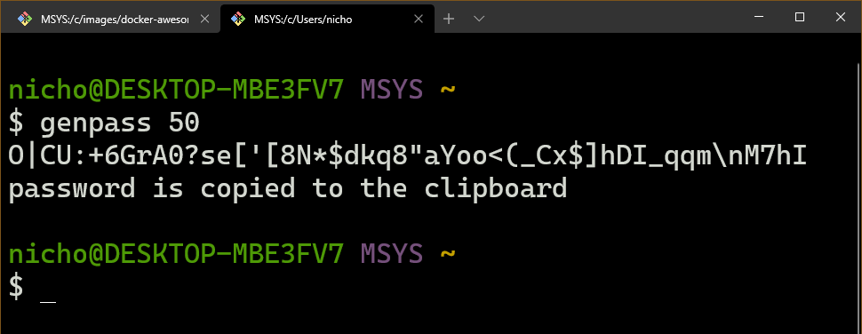

# Random Password Generator

Browser "suggest password" features are great, but are still too much work to access, then copy/paste into a password database app.  

Also, plenty of sites block this functionality. I'm talking to you, Unity password reset page...

## Features

Generates a user-specified length password, with a sensible / magical default of 10 character length otherwise.

The generated password is guaranteed to include at least one uppercase letter, one lowercase, one digit, and one special character (punctuation).

Plus, this program copies the password to your clipboard, on Windows, Mac, or Linux. Saves you a few clicks and key presses!

## Setting Up

Clone this repository:

```bash
$ git clone https://github.com/NicholasBallard/random-password.git randpass
```
_- or -_
```bash
$ gh repo clone NicholasBallard/random-password randpass
```

Then go into the newly minted folder:
```bash
$ cd randpass
```

## Building an Executable 
### (Windows, MacOS, or Linux)

This is optional, but makes life a lot easier. For one, no need to activate a virtual environment to isolate and run dependencies.

```bash
$ # python path variable name
$ # `python` on Windows, `python3` on Unix
$ python -m venv venv
$ # Windows: .\venv\Scripts\activate
$ # MacOS / Linux: ./venv/bin/activate
$ .venv\Scripts\activate
```

Now you should be in a virtual environment. Let's install dependencies `numpy` and `pyperclip`, as well as the executable building tool, `pyinstaller`:
```bash
(venv) $ # pip3 for you Unix'ers if `pip` doesn't work
(venv) $ pip install -r requirements.txt
```

You can run this script as long as the dependencies are installed, like `python randompassword.py 15`, for a 15 character password.

But I'm too cool to need to remember to activate the virtual environment every time I get locked out of a site, so here we're going to build the executable.

Like with any file, you can choose to include this file in a directory in your PATH variable, then you can run it from anywhere.

Build the executable:
```bash
(venv) $ pyinstaller --onefile randompassword.py
```

On Windows this creates an executable at `.\dist\randompassword.exe`.

On MacOS and Linux distros, `pyinstaller` outputs a Unix executable at `./dist/randompassword`.

## Finishing Up

Rather than put the executable in my PATH and wearing my fingers out typing `randompassword`, I added a function in my `.bashrc` in Git for Windows:

```bash
genpass() {
  "C:\scripts\randompassword\dist\randompassword.exe" $1
}
```

An `alias` in `~/.bash_aliases` would work fine for this too:
```bash
alias genpass="C:\scripts\randompassword\dist\randompassword.exe"
```

Reload `bash` with:

```bash
$ . ~/.bashrc
```

## Using

...and now you're good to generate passwords from the command line!


